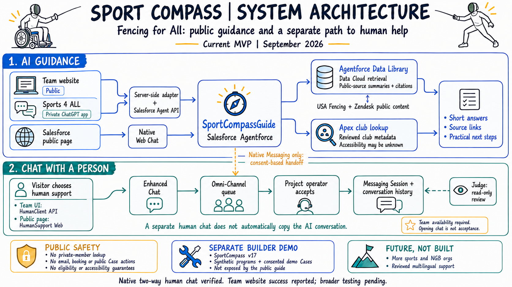
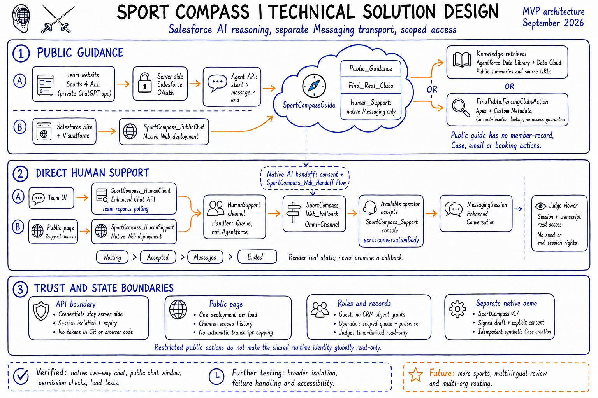
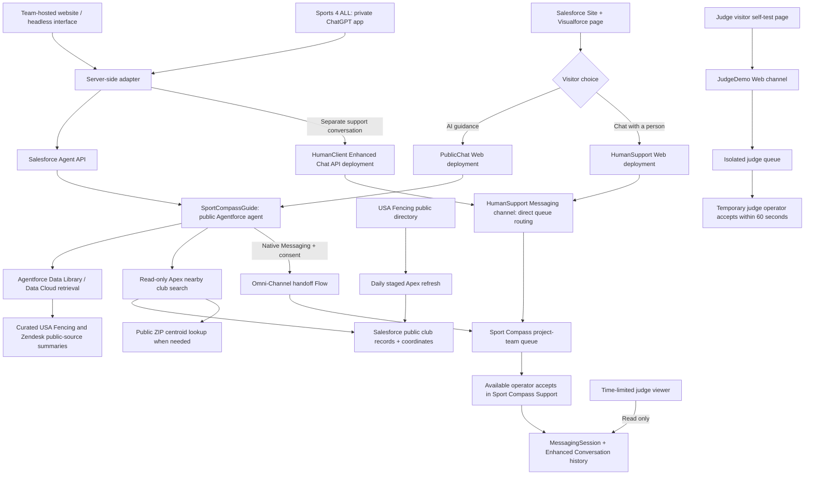

# Sports for All - Sport Compass

Fencing for All, powered by Sport Compass, helps athletes and families explore fencing and find a club that can support their needs.

**The agent never diagnoses a condition or makes classification or competition eligibility decisions.** Diagnosis belongs to qualified medical professionals. Official classifiers determine classification, and the relevant governing bodies and event officials determine competition eligibility.

**Find your sport. Navigate your next step.**

This Agentforce for Good Builder Track MVP focuses on fencing. Salesforce Agentforce powers public guidance through a headless API and a Salesforce-hosted chat. Enhanced Chat and Omni-Channel provide a separate human-support route. The earlier private ChatGPT development app is preserved in source but retired in favor of the team's integration. Other sports, reviewed multilingual support and a standalone mobile app remain planned.

Latest checkpoint: September 9, 2026. The public guide's introduction and welcome now prominently state that it never diagnoses or makes classification or competition eligibility decisions. Salesforce compilation, publication and activation passed; no test conversation was run for this wording update.

The public Agentforce guide now searches a synchronized Salesforce club directory.
The first full import contains 494 public source records, including 378 marked
active. Daily refresh is scheduled for 03:00 Pacific, with atomic publishing and
last-successful-data preservation. ZIP searches support 10, 25, 50 and 100 miles,
optional weapon filters and source-linked results. Distances are approximate
straight-line miles, not driving distances. A Para tag is not an accessibility
or class-availability guarantee.
See [directory architecture, setup and checks](docs/agentforce/CLUB_DIRECTORY.md).

Salesforce-hosted public fallback: [Ask Sport Compass on Salesforce](https://orgfarm-4d89d5ac56.my.salesforce-sites.com/sportcompass).
The branded Visualforce/Sites page is active, opens without a Salesforce login,
and uses the native Enhanced Chat client. A public-browser question and source-linked
Agentforce answer passed on September 7. It matches the team's logo, fencing avatar
and navy/blue theme. AI guidance remains the default. **Chat with a person** opens
a separate direct-to-team Enhanced Chat conversation on the same public page,
without an AI agent. The human window opens successfully; a fresh two-way exchange
from this landing page still needs a staffed check. See the
[public page verification](docs/agentforce/PUBLIC_SALESFORCE_PAGE.md).

The judge account has time-limited Enhanced Chat inspection access through
**Sport Compass Support > Messaging Sessions**, plus a separate temporary
self-test operator configuration through September 22. Its dedicated demo queue
does not receive normal public support chats. Judge presence and live acceptance
are confirmed, and the user reported the test worked. Visitor-side reply text
and final closure were not independently captured.
See [judge chat access and self-test steps](docs/agentforce/JUDGE_CHAT_ACCESS.md).

Current connection note: the team-managed public site is
[Ask Sport Compass](https://sports-4-all.org/ask). Its UI was inspected on
September 7, 2026; it uses a custom `/api/sports-for-all-chat` endpoint. This
inspection alone did not establish the server behavior. The subsequently supplied
`Sports4All.zip` confirms Salesforce Agent API calls; live specialist follow-up
has not been independently tested. The earlier local ChatGPT development connection
described below was retired at the project owner's request in favor of the team's
integration. Do not restart it as a prerequisite for the public website.

Native Salesforce human handoff passed consent, operator acceptance, two-way
messaging and session closure. The queue, routing flow, Enhanced Conversation
record page, operator console and scoped presence access are deployed.
SportCompassGuide version 4 is active with nearby directory search and the
existing Messaging-session-gated handoff.
The `SportCompass_HumanClient` API deployment is published and guest authorization
passed with HTTP 200. The team reported successful two-way website support chat
using polling. That report is distinct from the independently verified native test;
the live website's failure paths and visitor isolation still need verification.
Editing its ZIP snapshot does not deploy the live website. See the
[API integration handoff](docs/agentforce/ENHANCED_CHAT_API_HANDOFF.md) and
[human handoff checkpoint](docs/agentforce/WEB_HUMAN_HANDOFF.md).

## Implemented capabilities

- The original Sport Compass version 17 is active in the development org. Its native support-request demo remains intact.
- Ten indexed, project-prepared summaries ground guidance in USA Fencing and Zendesk sources. They are not USA Fencing-approved.
- The public guide searches synchronized USA Fencing club records in Salesforce. The original demo's two curated metadata listings and synthetic programs remain unchanged.
- Apex performs distance filtering and weapon matching against public records. Radius search requires a visitor-supplied US ZIP; city-only requests ask for the ZIP. Accessibility, equipment and parafencing availability require provider confirmation.
- Synthetic support requests use signed drafts, explicit confirmation, server-side validation and idempotent Case creation in a fixed support queue.
- The separate Salesforce public guide, SportCompassGuide, uses the public knowledge library and read-only directory search, with no Case, email, booking or private-record actions. Version 4 adds the prominent diagnosis, classification and eligibility boundary while preserving version 3's nearby search and the native Messaging-only human-transfer path introduced in version 2. Native acceptance and two-way replies passed previously. Agent API access does not by itself provide a human-chat transport.
- A dedicated human-only Messaging channel bypasses Agentforce and routes to the project team's Omni-Channel queue. Both native Web and Custom Client API deployments are configured.
- The archived development ChatGPT integration has a Sport Compass icon and four MCP tools: start, ask, end and show the first-visit planner. Its prior live checks are historical evidence, not a claim that the retired tunnel is running.
- Compact club cards show the club name, location, website and one visible `Needs confirmation` note. Listing sources expand on demand; **Plan my visit** opens the optional checklist.
- The first-visit planner offers selectable preparation topics, a checklist, one-question-at-a-time mode, a source-linked copyable plan, an unsent contact draft and personal progress marks.
- There are 69 passing local integration/UI-contract tests. Live Salesforce-backed ChatGPT text and interactive-card checks are recorded separately.

The planner's controls run locally in the card. They do not make additional AI calls or update Salesforce. Copying produces an unsent draft, not an email integration. In ChatGPT, clipboard restrictions can trigger a selected-text fallback for manual copying.

The September 8 directory deployment passed 13 selected Apex tests, and all 69
local integration/UI-contract tests pass. The importer and search classes exceed
94% line coverage in this run. Earlier 12-test and 30-test checkpoints concern the
original demo. An uninterrupted current-version native browser-to-Case demo
remains pending. None of these results establish production readiness, full
grounding accuracy or accessibility certification.

## Try the demo

1. Open [the Salesforce public page](https://orgfarm-4d89d5ac56.my.salesforce-sites.com/sportcompass), then **Start a conversation**.
2. Ask: "My daughter is 12 and uses a wheelchair. She wants to try fencing near Salt Lake City. Is that possible?"
3. Ask what to confirm about equipment and access before a first visit. Club listings are not verified parafencing or accessibility guarantees.
4. To try direct human support, finish the current chat and choose **Chat with a person**. A project operator must be Available in Sport Compass Support and accept the request. Opening the chat is not confirmation that a person has joined.

Judges reviewing Salesforce records should use **Sport Compass Support > Messaging Sessions**, not Command Center for Service. See [judge access](docs/agentforce/JUDGE_CHAT_ACCESS.md). Credentials are shared privately and are not stored in this repository.

For an unstaffed evaluation, judges can play both roles using the
[judge self-test page](https://orgfarm-4d89d5ac56.my.salesforce-sites.com/sportcompass/SportCompassJudgeDemo)
and their separately signed-in support console. Select **Available - Judge Demo Chat**
first, then send a fictional visitor message and accept the request within 60 seconds.
This routes only to the dedicated judge queue, not the public support team.

### Earlier ChatGPT interactive demo

The instructions below describe the retired private development connection and its
recorded tests. They are not a prerequisite for the current website or Salesforce
public page. Do not restart that connection without the project owner's approval.

With the private Sport Compass app selected in ChatGPT, ask:

> Find a real fencing club in Kaysville, UT. Show the interactive club card.

The compact result appears first, without a three-tab dashboard. Use **Plan my visit**, choose preparation topics and select **Build my checklist**. Try **One step at a time**, **Copy my plan**, or the expandable friendly message. **Back to club result** returns to the compact card. If manual-copy text appears, use Command-C on Mac. General fencing questions should stay conversational unless an interactive plan is requested.

The combined Kaysville search-and-planning question now returned Wasatch in a fresh live ChatGPT test. A reproduced comma-free Utah lookup failure was fixed in Apex, and three direct Salesforce-backed MCP regression checks passed. Broader query/routing reliability remains unproven. Unknown accessibility must never be treated as proof of inaccessibility or as a verified accessible match.

Use **Copy my plan** for the ChatGPT demo. The portable HTML export is implemented for hosts that advertise file-download support, but the tested ChatGPT view did not complete a download. The v4 card hides unsupported download controls and provides manual copying after a failed request. No background upload or additional file-hosting service is used. See [search and export evidence](docs/agentforce/SEARCH_AND_EXPORT.md).

This is an account-connected private development app, not a publicly published ChatGPT directory listing. The Mac and approved private tunnel must remain running. See [interactive setup and evidence](docs/agentforce/INTERACTIVE_FIRST_VISIT.md).

## System architecture

### Hand-drawn architecture views

Current September 2026 views include the public team website, the ready private
**Sports 4 ALL** ChatGPT app, Salesforce-hosted chat, and separate human support.
The ChatGPT app is private, not a public directory listing. Its availability is
team-reported; the earlier local development app and tunnel remain retired.





Open the [system overview](docs/architecture/system-design-v2.png) or
[technical design](docs/architecture/technical-solution-design-v2.png) at full size.
See [text descriptions and diagram notes](docs/architecture/README.md).



The Agent API is the headless **AI** interface. Enhanced Chat is the **human
conversation transport**. An Agent API session is not a Messaging Session and
does not automatically transfer to a human. The team's separate support path
starts a new Messaging conversation. Earlier AI messages are not copied by the
Salesforce public page's mode switch.

### Technical stack

| Layer | Implementation |
| --- | --- |
| Public Salesforce UI | Salesforce Sites, controller-free Visualforce, static PNG resources, HTML/CSS/JavaScript |
| Team website | Independently deployed UI and server-side adapter; `Sports4All.zip` is a supplied snapshot, not an automatic deployment source |
| AI reasoning | Agentforce Agent Script, scoped subagents and actions in `SportCompassGuide` |
| Grounding | Agentforce Data Library backed by Data Cloud retrieval, ten project-prepared public-source summaries and original source links |
| Club discovery | Deterministic Apex `FindPublicFencingClubsAction`, reviewed public-club Custom Metadata |
| Human support | Enhanced Chat Web and Custom Client API deployments, Messaging channel, Omni-Channel queue and presence configuration |
| Operator console | Lightning Console app, Omni-Channel utility and `scrt:conversationBody` Enhanced Conversation component |
| Access control | Salesforce permission sets and record sharing; public operator, judge viewer, and temporary judge-only test operator roles |
| Preserved development integration | Node.js MCP server, MCP Apps SDK and interactive first-visit planner; earlier private tunnel retired |
| Source and verification | Salesforce CLI/API 67, GitHub, Apex tests, Node.js contract and mock tests |

### Three bounded journeys

1. **Public guidance:** a visitor asks a fencing question. Agentforce retrieves
   source-backed guidance or calls the Apex club lookup, then gives a short answer
   with a source and any important uncertainty. No member lookup or business write
   is exposed through this public guide.
2. **Human support:** a new direct-human chat routes to the project queue. A team
   operator must be online, have capacity and accept before a human connection is
   established. The native AI-first channel also supports consent-based handoff
   through `SportCompass_Web_Handoff`. The team reported polling in its custom UI;
   native client and custom transport verification are tracked separately.
3. **Original Builder demo:** `SportCompass` version 17 remains separate. It can
   match explicitly synthetic programs and use signed drafts, explicit consent
   and idempotent Apex to create synthetic Cases. Those actions are not exposed
   through `SportCompassGuide` or the public support page.

### Security and operational boundaries

- Credentials remain server-side. Never place Salesforce secrets, guest tokens,
  signed URLs or judge passwords in Git, browser code or chat-tool arguments.
- Public conversation handles are bearer capabilities, not authenticated member
  identities. Visitor isolation, expiry and authorization are required at each
  adapter boundary. Do not expose private records through the anonymous adapter.
- The existing runtime identity has permissions required by the native demo.
  Restricted public agent actions do not mean that identity is globally read-only.
- The public Site guest profile was checked for zero object-permission grants.
  Messaging still creates and retains conversation records through the platform.
- The public page initializes one deployment per load and enables channel-scoped
  history. Switching AI/human views resets the window, not the underlying record
  retention policy. No cross-channel transcript copying is implemented.
- A person from the project team is not an official USA Fencing representative.
  No guaranteed staffing, callback, eligibility or accessibility claim is made.

### Deployment and adoption

This is the hackathon org's working configuration, not a one-command production
package. Target orgs need Agentforce, Data Library/Data Cloud and Enhanced Chat
entitlements and setup. Create and publish the relevant messaging deployments,
register the Site domain, configure a real operator, assign the required licenses,
queue/presence access and permission sets, then test as a visitor and as a judge.

Metadata contains this org's usernames, generated site names, routing identifiers
and public asset URLs. Adapt those values before deployment elsewhere. Generated
ESW supporting sites, license assignments, publication and user-specific permission
expiry are setup steps, not fully recreated by this source export. The historical
ChatGPT tunnel is not a required infrastructure dependency.

The reusable pattern separates public sport content and club metadata from
Agentforce, chat transport and support routing. Extending it to other sports or
NGB Salesforce orgs is a future configuration/integration path, not an implemented
multi-org routing feature.

## Repository layout

- `force-app/`: editable Agent Script, Apex, objects, public club metadata, permissions and reporting.
- `knowledge/`: curated sources and retrieval fixtures.
- `data/`: labeled synthetic seed data.
- `mcp-server/`: live public and mock entrypoints, session handling, UI resource, credential helper source and tests.
- `mcp-server/ui/`: interactive first-visit HTML, CSS and JavaScript.
- `assets/branding/`: original icon, compact ChatGPT upload asset and design notes.
- `scripts/`: scoped setup and verification. Live tests can create synthetic Cases; review before running.
- `docs/`: current status, build plan, architecture and historical test evidence.

Generated snapshots, org-bound OAuth exports, credentials, dependencies and raw traces are excluded from Git. This is not a complete org backup. See [repository guide](docs/REPOSITORY_GUIDE.md).

## Local checks

Node 22 or later:

```sh
cd mcp-server
npm ci --ignore-scripts
npm test
npm run smoke:mock
cd ..
node scripts/verify-agent-draft.mjs
node --test scripts/test-public-page.test.mjs
```

These checks need no Salesforce credentials and create no CRM records.

To inspect the UI with labelled fixture data:

```sh
cd mcp-server
npm run build:ui
npm run preview:ui
```

Open `http://127.0.0.1:4177`. The local preview supports phone-width and dark-theme checks and does not contact Salesforce. Build the UI before starting the live public entrypoint. Generated `mcp-server/dist/` output is excluded from Git.

The UI uses the official MCP Apps SDK with a self-contained bundle. Existing MCP SDK, MCP Apps and esbuild versions are pinned in the package lock. No additional paid service or public web hosting was introduced.

## Verified and still pending

- Verified locally: 69 tests; prior compact-card checks covered 375-pixel width, dark theme, optional checklist, one-step keyboard controls and return navigation. The export document was visually inspected and the local host received its download request.
- Verified in ChatGPT: the combined Kaysville lookup returned a v3 Wasatch card and built its checklist. The download attempt produced a selected-text fallback, not a confirmed saved file. Earlier checks covered source links, changing topics, keyboard navigation and manual-copy fallback with developer-mode CSP enforcement enabled. ChatGPT can still add a summary beneath the card.
- Still pending: broader query/multi-turn/adversarial tests, domain review, complete screen-reader/keyboard review and the organizer-provided Accessibility Expert and RAI Self Check skills. File download is not an accepted ChatGPT demo feature.
- Not implemented: email sending, outbound calls, bookings, payments, public-channel Case creation, server-persisted plans, verified provider-accessibility feeds, public ChatGPT app-directory submission or a production operations/support commitment. The Salesforce public page is deployed in the hackathon org.

The two supported card identities mirror committed Salesforce public-club metadata and appear only when the latest Salesforce reply includes the exact identity and approved website. This is not a direct structured Apex result or an accessibility audit. Card choices reset when the card is recreated; they are not persisted to Salesforce or used as proof of attendance.

Start with [interactive planner](docs/agentforce/INTERACTIVE_FIRST_VISIT.md), [live Salesforce/ChatGPT connection](docs/agentforce/LIVE_PUBLIC_CHATGPT.md), [current status](docs/STATUS.md), [support evidence](docs/agentforce/SUPPORT_FIX_V8.md) and [MCP setup](mcp-server/README.md). Earlier checkpoint documents are historical. Architecture images show the intended design, not proof that every component is live.

## Data and safety

Never commit credentials, authentication files, raw capability-bearing traces, private exports or participant medical details. Synthetic examples must remain labeled. Public sources do not establish accessibility, eligibility or endorsement. The agent does not diagnose impairments or make official classification decisions.

## License

The project's original code and accompanying documentation are available under the
[MIT License](LICENSE), copyright 2026 Sports for All contributors. Third-party
dependencies, third-party source material, trademarks and branding retain their
respective licenses and rights. This license does not grant rights to USA Fencing,
Salesforce or other organizations' marks or imply their endorsement.
